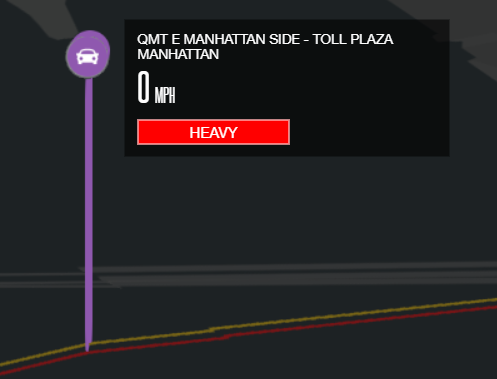
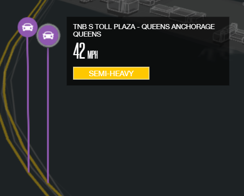
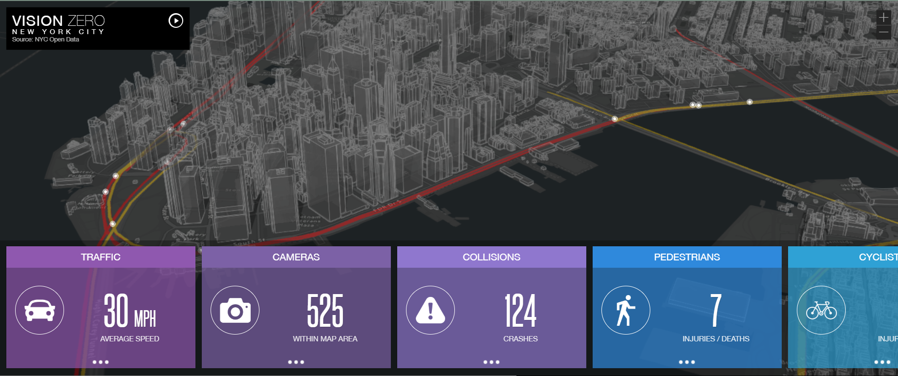
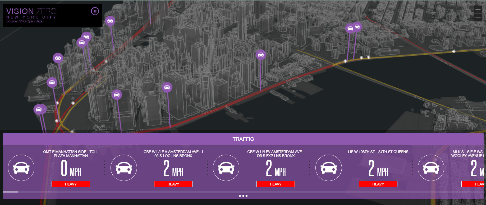
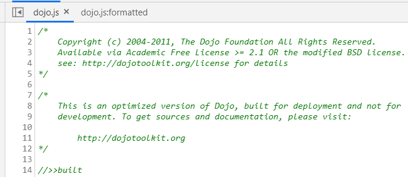
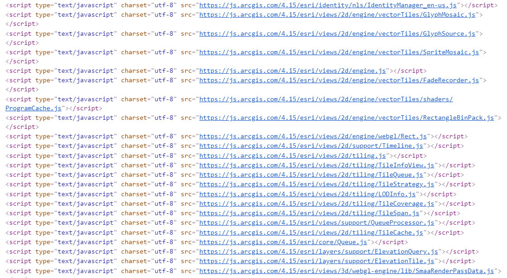
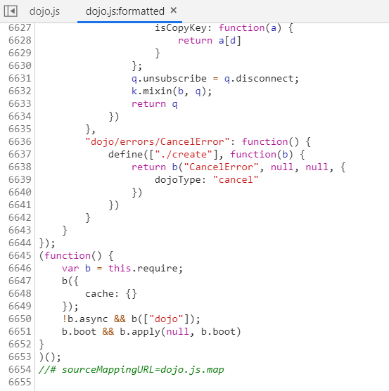
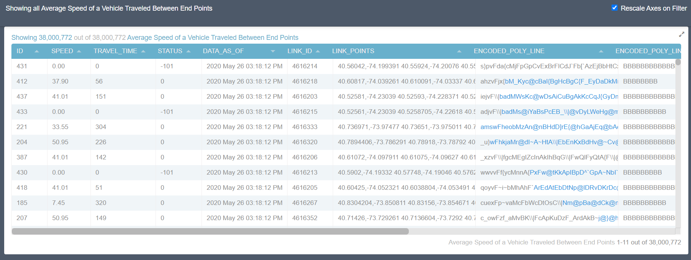

<h1> Analyzing a Smart Vision Zero Dashboard of New York City </h1>
<h2> Mapping Real Time Traffic </h2>
Dashboard created by: <a href="https://twitter.com/SpatialAgent"> @SpatialAgent </a>

 

<h3> Introduction </h3>
I will be analyzing a digital project a web dashboard application made by Sajit Thomas who is also known as <a href="https://twitter.com/SpatialAgent"> @SpatialAgent </a> on Twitter. I am not sure if he is affiliated with ESRI, but he does work with ESRI products and Open Data. I came across this web dashboard when I was exploring the collection of other web applications that he has created. This specific one I chose displays a city-scale of New York City where real-time traffic data is visualized. Additionally, the map shows “...accidents, traffic cameras, air quality and weather in New York City”. (Cool Maps)

 

One of the major functions of this web dashboard is to display information about New York City. The map is part of the series <a href="http://coolmaps.esri.com/ "> Cool Maps </a> where a few other maps are based on New York City but shows different information in the series. This is “<i>..a collection of creative maps that use the ESRI mapping platform to demonstrate how solutions can be enriched with the power of location and how they are designed to stimulate ideas and are for demonstration purposes only</i>”! (Cool Maps)

 

Another purpose of this web dashboard is to show the viewer the vast amount of information all in one place, so that we do not need to search for the information ourselves. It is a nice collective touch.
Based on an educated guess, I believe the target audience is GIS idea seekers, the general public, and curious onlookers. The sole purpose of these cool maps is for sparking inspiration and as they said in their description, “<i>designed to stimulate ideas</i>” and I definitely would love to try to replicate some of what is displayed. If I were to think of it in a general public view, I can see how this helps commuters from cars, walking to motorcycling to know how the traffic is or to see where traffic may be held up by attending incidents. Adding to that, the web dashboard can be catered towards different awareness organizations as well, but I am not sure.

 

<h3> First Glance </h3>
When I first clicked the link there is a sleekly designed title screen and a color-changing title box is shown. A button to `view map` was present and once I clicked it, I was introduced to the entire dashboard.

At first glance, the map shows a default specific area for the New York City area, I can see that it has a <b>dark basemap</b> and the bright <b>white outlines </b> of buildings. As I am exploring around, I can see that there are these white dots. I think they possibly indicated a possible aggregation of multiple cars that travel in the same direction. It also could be an <b>aggregation of cars</b> that are maybe heading the same speed. I am also able to see, what I believe are the major roads that are displayed with the colors of red and yellow which may be displaying the intensity amount of traffic that is on the said major road.

Turns out red means `heavy` traffic while yellow means `semi-heavy` traffic, which is cool and personally is easy to understand the symbology.
Something nice for interactivity is when I click on the 3 circles next to, for example, the cyclists button (refer to screen capture below, in yellow) and it opens and displays the screen capture on the right. It shows the specific date and time information for the cyclist incident. It will tell me the injuries and deaths that describe that single individual data entry. Also, they use military time to show the time which is helpful to distinguish what time the incident happened. Lastly, I can close the single view of the data entry and go back to the main view by clicking the same 3 circles.

<h3> Systematic Architecture </h3>
On the client-side, the controls are simple. For starters, I can click the button `view map` to send a request to the server to retrieve the real-time data and the map. For the client, as soon as I click that button I am introduced to the dashboard, and on the dashboard, I can interact with the provided information and see the different statistics that are displayed in front of me. From then, there are these 3 circle indicators to show that I can interact by clicking on them and opening the options & menus. On the server-side, they are receiving the requests from me to open options & menus and they react by sending back more information and allowing me to look at multiple information at the same time. I believe the server stores temporary data on what the client decides to view and will remove it after the client closes a window.

 

For example, referring to the screenshots below, there is a play/pause button in the top left corner. The first screenshot shows the play button and the default option when the web dashboard is loaded. The second screenshot shows the view is activated and I can see the different car data on the screen. The client-side see these, but the server-side is different, it needs to pull the information about those cars’ individual speed, the specific location and display them in view. When the client moves around, the server-side continues to update the information.

The data they used was from NYC Open Data and they used it to display individual data entries of the collisions and locations of cameras and display weather information.
The service I saw was using Dojo’s Toolkit which helps build web applications. By checking out the Inspect > Sources > ajax.googleapis.com > dojo.js I saw that Dojo was used and that is cool to find!

<h3> Code Inspection </h3>
Libraries
<ul>
<li> ESRI </li>
<li> Dojo Toolkit </li>
</ul>
The author used the ESRI library a lot when creating the web dashboard. Along with using Dojo Toolkit too. I am not sure if they count as libraries, but I see them most often mentioned. By looking at the code, a lot of the implementations were JavaScript work and it paid off to do all this work!

There was a lot of work done for this it turns out that in this specific .js file that there was a plentiful amount of knowing how to use I think python functions? I am not too familiar with python, but the format looks close to it!

To end this section off, the project supports slower responsive design, when initially loading in, the loading time is slow. I think this is a bit acceptable because the server-side is pulling a lot of information from wherever the data is and, understandably, it will take a while for the information to load in. Additionally, it is also kind of worth it because the quality of the work makes up for the loading time.

<h3> Data Sources </h3>
<ul>
<li> New York City Open Data </li>
</ul>
The majority of data comes from the New York City open data portal, by checking out the website for New York City’s open data I saw that most of the information there is in dataset form. From making an educated guess and from looking at the data entries, I can see how the author decided to implement the datasets as individual cars or points that represent one single thing of the web dashboard. He brings a lot of information together in one single view.
For example, in the screenshot below, the column of `travel speed` equals the miles per hour (mph) on the web dashboard and also shows `link_points` which acts as the coordinate points of the specific individual cars.

<h3> Design </h3>
Overall, the sleek design of the web dashboard makes it have a feeling of it being modern but there is a limit to the functions. I can zoom in and see specific streets and their names, aside from that I also know which route has the <b>highest amount of traffic</b>. I can look at the different building vectors and can check out the different angles that the right mouse button allows me to.
The overall base map is <b>dark gray</b>, and it makes it easier for colors to pop because to me it has an almost neon feel to it. The bright outlines that represent the buildings are simple, but they do a good job. Additionally, having this basemap makes all the other map features show in the spotlight. Another nice thing is that the street names are not as protruding as individual cars. The web map portion is not a traditional map. It does not have any very noticeable map elements. But after exploring the web dashboard a bit more, it is apparent that you can figure out what the colors and features are meant to do.

<h3> Strengths </h3>
One of the biggest strengths of this web dashboard is how it shows individual data points, which is determined by which specific data entry it is pulling information from. New York City's open data set provides data about, for example, a car’s speed and location. It puts into perspective what the traffic flow currently is in that specific location in New York City. Additionally, it shows car, pedestrian and motorcyclist, and cyclist accident data too.

<h3> Weaknesses </h3>
One of the major weaknesses of the web dashboard has to be the minimal amount of information or limited view of information. Understandably it was probably to keep a more modern, sleek, and inspirational design. Also, another weakness is how it requires you to learn how to navigate the web dashboard, for me it was easy to do so but for others, it might be a different story. There is a learning curve of how to use this application, but it is very doable after playing around with it. Lastly, the initial loading of the web dashboard is slow but bearable. As I load in, I can see a smaller view of the big scale of visuals the web dashboard holds.

<h3> Social Implications Reflection </h3>
An idea that came to mind was surveillance and privacy issues. While looking at the web dashboard, there are options to choose which security camera to check the footage of. There were 2 main types of cameras, one for the highways and freeways and the other one was for the main streets of New York City. Understandably, the traffic cameras are not high resolution, but I would be able to see someone’s commute if I wanted to. Supposedly there are 525 cameras that are stationed all over the New York City area and some that are a little further than expand to other city limits. But regardless, I can see if pedestrians walk by or see cars go, this begs the question about if someone had total privacy or that there are issues with new york residents being filmed without knowing.

 

Another issue could be the feeling of being watched, although not all the streets have cameras on them, I can think of countless scenarios where someone may not have consented to be filmed on camera and their rights or something is being broken. But also, there can be residents who do not mind being filmed, I think probably if there was no malicious intent behind it but still an issue to raise!
